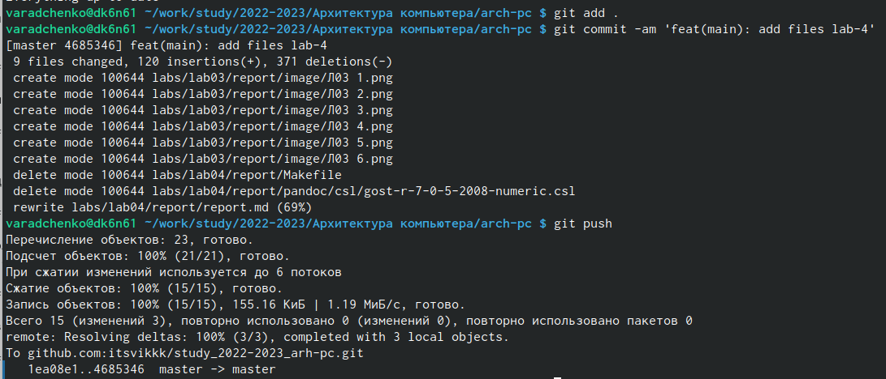

---
## Front matter
title: "Архитектура компьютеров"
subtitle: "Oтчёт по лабораторной работе №3"
author: "Виктория Андреевна Радченко"

## Generic otions
lang: ru-RU
toc-title: "Содержание"

## Bibliography
bibliography: bib/cite.bib
csl: pandoc/csl/gost-r-7-0-5-2008-numeric.csl

## Pdf output format
toc: true # Table of contents
toc-depth: 2
lof: true # List of figures
lot: true # List of tables
fontsize: 12pt
linestretch: 1.5
papersize: a4
documentclass: scrreprt
## I18n polyglossia
polyglossia-lang:
  name: russian
  options:
	- spelling=modern
	- babelshorthands=true
polyglossia-otherlangs:
  name: english
## I18n babel
babel-lang: russian
babel-otherlangs: english
## Fonts
mainfont: PT Serif
romanfont: PT Serif
sansfont: PT Sans
monofont: PT Mono
mainfontoptions: Ligatures=TeX
romanfontoptions: Ligatures=TeX
sansfontoptions: Ligatures=TeX,Scale=MatchLowercase
monofontoptions: Scale=MatchLowercase,Scale=0.9
## Biblatex
biblatex: true
biblio-style: "gost-numeric"
biblatexoptions:
  - parentracker=true
  - backend=biber
  - hyperref=auto
  - language=auto
  - autolang=other*
  - citestyle=gost-numeric
## Pandoc-crossref LaTeX customization
figureTitle: "Рис."
tableTitle: "Таблица"
listingTitle: "Листинг"
lofTitle: "Список иллюстраций"
lotTitle: "Список таблиц"
lolTitle: "Листинги"
## Misc options
indent: true
header-includes:
  - \usepackage{indentfirst}
  - \usepackage{float} # keep figures where there are in the text
  - \floatplacement{figure}{H} # keep figures where there are in the text
---

# Цель работы

Целью работы является освоение процедуры оформления отчетов с помощью легковесного языка разметки Markdown.

# Задание

1. Откройте терминал.
2. Перейдите в каталог курса сформированный при выполнении лабораторной работы №3.
3. Перейдите в каталог с шаблоном отчета по лабораторной работе №4.
4. Проведите компиляцию шаблона с использованием Makefile.
5. Удалите полученный файлы с использованием Makefile. Проверьте, что после этой команды файлы report.pdf и report.docx были удалены.
6. Откройте файл report.md c помощью любого текстового редактора, например gedit.
7. Заполните отчет и скомпилируйте отчет с использованием Makefile. Проверьте корректность полученных файлов. (Обратите внимание, для корректного отображения скриншотов они должны быть размещены в каталоге image).
8. Загрузите файлы на Github.

# Выполнение лабораторной работы

1. Открываем терминал, переходим в каталог курса сформированный при выполнении лабораторной работы №3.

{#fig:001 width=90%}
 
2. Обновляем локальный репозиторий, скачав изменения из удаленного репозитория с помощью команды git pull.

{#fig:001 width=90%}

3. Переходим в каталог с шаблоном отчета по лабораторной работе № 4.

{#fig:001 width=90%}

4. Проведём компиляцию шаблона с использованием Makefile. Для этого вводим команду make. Затем проверим правильность введенных данных.

{#fig:001 width=90%}

5. Удалим полученный файлы с использованием Makefile. Для этого введём команду make clean. Проверим, что после этой команды файлы report.pdf и report.docx были удалены.

{#fig:001 width=90%}

6. Скомпилируем отчет с использованием Makefile. Проверим корректность полученных файлов.

{ #fig:001 width=90%}

7. Загружаем файлы на Github.

{#fig:001 width=90%}

# Выводы

В ходе работы я освоила процедуру оформления отчётов с помощью легковесного языка разметки Markdown.
