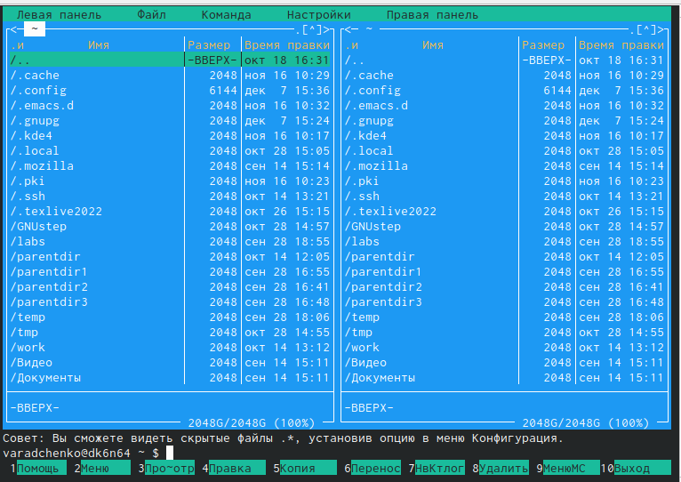
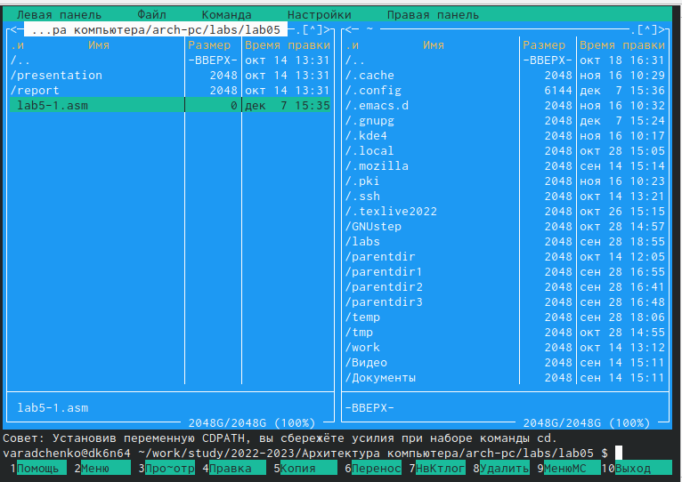
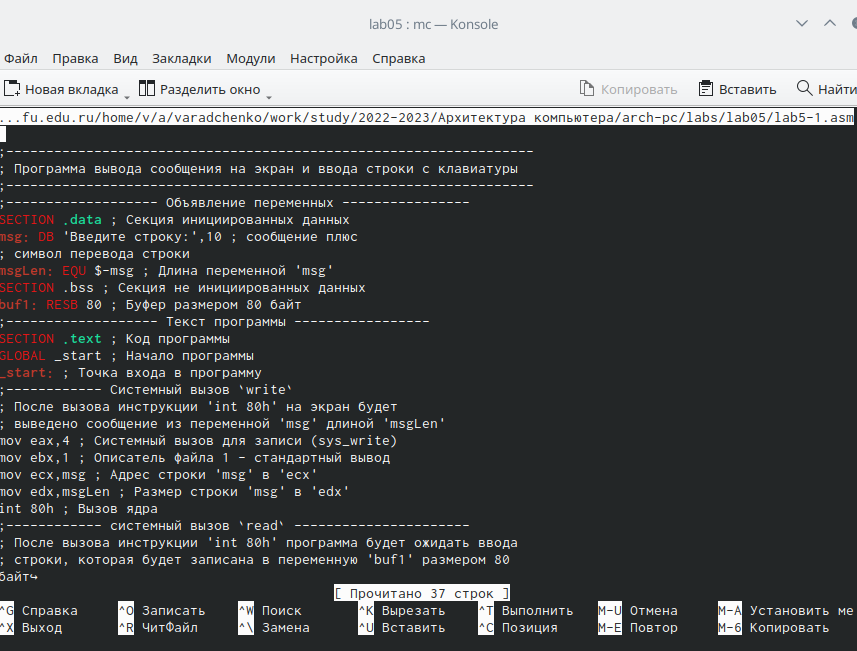
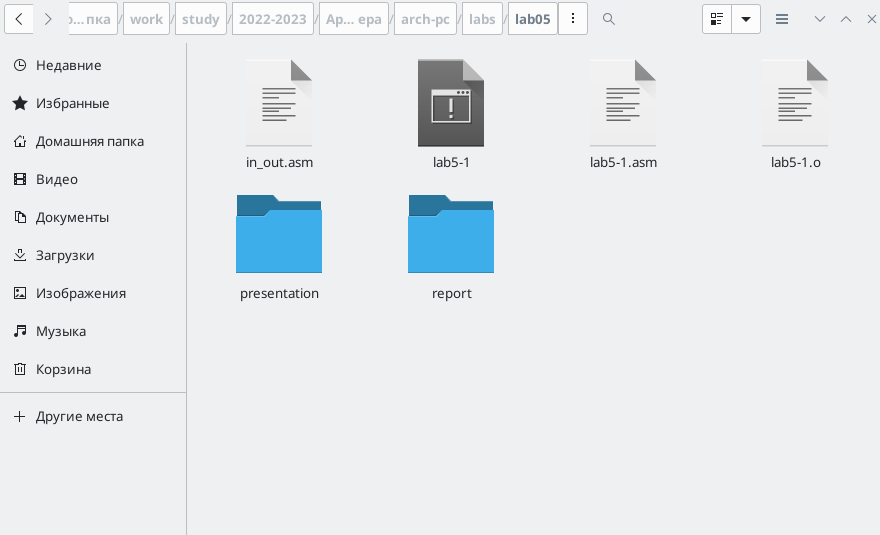
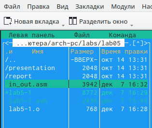
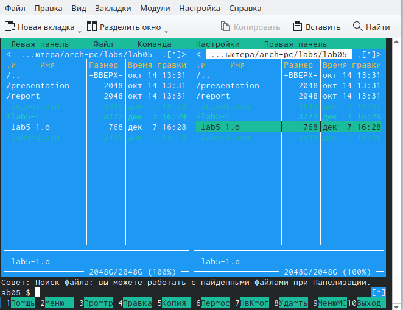

---
## Front matter
title: "Шаблон отчёта по лабораторной работе"
subtitle: "Лабораторная работа №5"
author: "Виктория Андреевна Радченко"

## Generic otions
lang: ru-RU
toc-title: "Содержание"

## Bibliography
bibliography: bib/cite.bib
csl: pandoc/csl/gost-r-7-0-5-2008-numeric.csl

## Pdf output format
toc: true # Table of contents
toc-depth: 2
lof: true # List of figures
lot: true # List of tables
fontsize: 12pt
linestretch: 1.5
papersize: a4
documentclass: scrreprt
## I18n polyglossia
polyglossia-lang:
  name: russian
  options:
	- spelling=modern
	- babelshorthands=true
polyglossia-otherlangs:
  name: english
## I18n babel
babel-lang: russian
babel-otherlangs: english
## Fonts
mainfont: PT Serif
romanfont: PT Serif
sansfont: PT Sans
monofont: PT Mono
mainfontoptions: Ligatures=TeX
romanfontoptions: Ligatures=TeX
sansfontoptions: Ligatures=TeX,Scale=MatchLowercase
monofontoptions: Scale=MatchLowercase,Scale=0.9
## Biblatex
biblatex: true
biblio-style: "gost-numeric"
biblatexoptions:
  - parentracker=true
  - backend=biber
  - hyperref=auto
  - language=auto
  - autolang=other*
  - citestyle=gost-numeric
## Pandoc-crossref LaTeX customization
figureTitle: "Рис."
tableTitle: "Таблица"
listingTitle: "Листинг"
lofTitle: "Список иллюстраций"
lotTitle: "Список таблиц"
lolTitle: "Листинги"
## Misc options
indent: true
header-includes:
  - \usepackage{indentfirst}
  - \usepackage{float} # keep figures where there are in the text
  - \floatplacement{figure}{H} # keep figures where there are in the text
---

# Цель работы

Приобретение практических навыков работы в Midnight Commander. Освоение инструкций языка ассемблера mov и int.

# Задание

Здесь приводится описание задания в соответствии с рекомендациями
методического пособия и выданным вариантом.

# Теоретическое введение

Midnight Commander (или просто mc) — это программа, которая позволяет просматривать структуру каталогов и выполнять основные операции по управлению файловой системой, т.е. mc является файловым менеджером. Midnight Commander позволяет сделать работу с файлами более удобной и наглядной.

Для активации оболочки Midnight Commander достаточно ввести в командной строке mc и нажать клавишу Enter.

В Midnight Commander используются функциональные клавиши F1 — F10 , к которым привязаны часто выполняемые операции.

Программа на языке ассемблера NASM, как правило, состоит из трёх секций: секция кода программы (SECTION .text), секция инициированных (известных во время компиляции) данных (SECTION .data) и секция неинициализированных данных (тех, под которые во время компиляции только отводится память,а значение присваивается в ходе выполнения программы) (SECTION .bss).

# Выполнение лабораторной работы

1. Открываем Midnight Commander, затем переходим в каталог ~/work/arch-pc созданный при выполнении лабораторной работы №5. С помощью функциональной клавиши F7 создаём папку lab06 и переходим в созданный каталог. 

{#fig:001 width=90%}

2. Пользуясь строкой ввода и командой touch создадим файл lab6-1.asm.

{#fig:002 width=90%}

3. C помощью функциональной клавиши F4 открываем файл lab6-1.asm для редактирования во встроенном редакторе. Как правило в качестве встроенного редактора Midnight Commander используется редакторы nano.

{#fig:003 width=90%}

4. Введём текст программы из листинга 6.1 (можно без комментариев), сохраним изменения и закроем файл, используя клавиши ctrl + x + y.

{#fig:004 width=90%}

5. С помощью функциональной клавиши F3 открем файл lab6-1.asm для просмотра. Убедимся, что файл содержит текст программы.

6. Оттранслируем текст программы lab6-1.asm в объектный файл. Выполним  компоновку объектного файла и запустите получившийся исполняемый файл. Программа выводит строку 'Введите строку:' и ожидает ввода с
клавиатуры. На запрос введите Ваши ФИО.

{#fig:005 width=90%}
7. Скачаем файл in_out.asm со страницы курса в ТУИС.

{#fig:006 width=90%}

8. Подключаемый файл in_out.asm должен лежать в том же каталоге, что и
файл с программой, в которой он используется.

{#fig:007 width=90%}

9. С помощью функциональной клавиши F6 создаем копию файла lab6-
1.asm с именем lab6-2.asm. Выделим файл lab6-1.asm, нажмём клавишу
F6, введём имя файла lab6-2.asm и нажмём клавишу Enter.

{#fig:008 width=90%}

10. Исправим текст программы в файле lab6-2.asm с использование подпрограмм из внешнего файла in_out.asm  в соответствии с листингом 6.2.Создадим исполняемый файл и проверим и его работу.

{#fig:009 width=90%}

11. В файле lab6-2.asm заменим подпрограмму sprintLF на sprint. Создадим исполняемый файл и проверим его работу.

{#fig:010 width=90%}

# Выводы

В ходе проделанной работы я научилась работать с текстовым редактором nano, поработала с программой Midnight Commander. С помощью имеющихся навыков я офрмила отчёты в форматах word, pdf, md.
# Список литературы{.unnumbered}

::: {#refs}
:::
